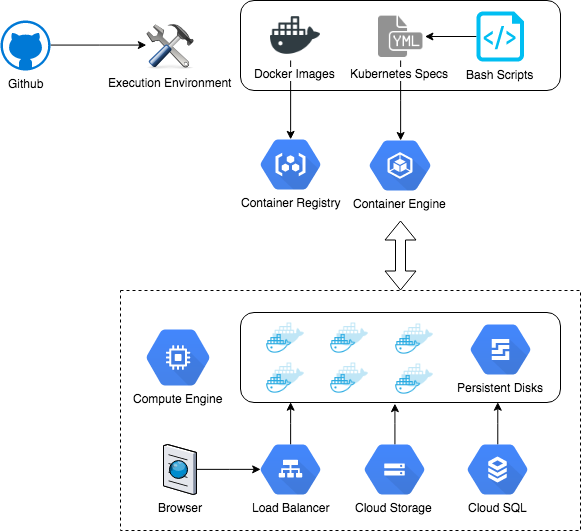

# Outrider
ysf: outrider is a battleship in starwars and battleships carries x-wing fighters

Nothing else matters !! till the sales happens - V (for vendetta)

cost x cost x cost = 3xcost * 0 sales = 0. WE NEED THE DEMO READY.

# Using this repository

## Setting up your Workstation
You need to setup your computer to use this repository. This is a one time process for each computer where this repo needs to be used. The following guide assume that you are on OSX.

You need brew and cask, install them using:
```bash
/usr/bin/ruby -e "$(curl -fsSL https://raw.githubusercontent.com/Homebrew/install/master/install)"
brew tap caskroom/cask
```

Next, install google-cloud-sdk and kubernetes-cli using:
```bash
brew cask install google-cloud-sdk
brew install kubernetes-cli
```

In the next step, you will initiate google-cloud-sdk and configure it to use intentaware project. Running the following command will open a browser window and ask you to login. In the following screens, you will choose the project-id and the region. Please make sure to select us-east1-d.
```bash
gcloud init
```

Now you can clone this repository on any location on your computer. To do that:
```bash
git clone https://github.com/intentaware/outrider.git
```

Before you can start using the scripts, you need to place a key in the root of the repository that you cloned. The key can be obtained from stingerpk through secure channels.

This repository contains two docker images and configurations for both a production cluster and a demo cluster. The scripts to setup the production cluster are in the repository root whereas the scripts for demo are in the folder called demo-cluster. These scripts setup the compute instances, containers, databases, loadbalancers, persistent disks and other components necessary to bring the service to life. There are a few resources which are permanently defined in the google cloud. They include container images and storage buckets.

## Setting up Production Cluster
There are 4 scripts which need to be run in a particular order. The first one is the create-prod-cluster.sh which sets up the base cluster. To run:
```bash
sh create-prod-cluster.sh <db_name> <db_password>
```

Once this runs successfully, proceed to add the first user:
```bash
sh create-prod-user.sh <unique_user_id>
```
This script will return the loadbalancer on which user's dashboard can be accessed. You can use this script multiple times to add multiple users.

To remove any user, use:
```bash
sh delete-prod-user.sh <unique_user_id>
```

To remove the entire cluster, use:
```bash
sh delete-prod-cluster.sh
```

After deleting the cluster, you must manually perform the following checks:
1. Go to Compute Engine --> Disks and delete the unused persistent disks.
2. Go to Network services --> Load balancing and confirm that loadbalancers have been removed.
3. Go to Storage --> SQL and delete the database with prefix ia-prod-.
4. Go to Storage --> Storage --> Browser --> ia-production-store --> druid and delete the folders named segments and indexing-logs.
5. Remember that you should not delete the project, images in container registry, storage buckets and any of the network settings."

## Setting up the Demo
The scripts for the demo cluster add the base platforms and 1 user on a single machine. To set it up, run:
```bash
cd demo-cluster
sh create-demo-cluster.sh <db_name> <db_password>
```

To destroy, use:
```bash
sh delete-demo-cluster.sh
```

After deleting the cluster, you must manually perform the following checks:
1. Go to Compute Engine --> Disks and delete the unused persistent disks.
2. Go to Network services --> Load balancing and confirm that loadbalancers have been removed.
3. Go to Storage --> SQL and delete the database with prefix ia-demo-.
4. Go to Storage --> Storage --> Browser --> ia-demo-store --> druid and delete the folders named segments and indexing-logs.
5. Remember that you should not delete the project, images in container registry, storage buckets and any of the network settings."

## Setting up the Dashboard
To setup the user dashboard, go to the loadbalancer IP provided by the script (or check it in Network services --> Load balancing) and add the druid cluster.

### For Production Cluster
If you added a production cluster, the settings for druid cluster are:

Coordinator Host: prod-coordinator-hs.default.svc.cluster.local

Coordinator Port: 8081

Broker Host: prod-broker-hs.default.svc.cluster.local

Broker Port: 8082

### For Demo Cluster
If you added a demo cluster, the settings for druid cluster are:

Coordinator Host: demo-coordinator-hs.default.svc.cluster.local

Coordinator Port: 8081

Broker Host: demo-broker-hs.default.svc.cluster.local

Broker Port: 8082

Once you have added the druid cluster, keep refreshing the druid metadata until the data source is detected. In new clusters it will take a while to detect the data source.

Now you can start querying data in the dashboard.

# Technical details

## Structure of the repository
This repository contains three docker images and two cluster specifications. The docker images are in the folders druid-image, divolte-image and superset-image. The specifications for the demo are in the folder demo-cluster. The bash scripts in the repository root and the folders user-template and prod-cluster contain specifications for the production cluster.

## Docker images
Each of the three docker image folders contain a Dockerfile and a Makefile. While the Dockerfile contains the build steps, the Makefile contains the version numbers and code to execute the build in the Google container registry.

### Versioning
The version of each docker image follows the convention: BASE_SOFTWARE_VERSION-OUR_INTERNAL_VERSION. For example, at the time of writing this documentation, we are using Divolte 0.6.0 and the version tag of our divolte image is 0.6.0-0.2.3.

### Druid Container
The Druid docker image provides a few enhancements to the other images available on the internet. This includes running the processes under a user, adding support for Google Cloud Storage and some fixes which make it suitable to run in the docker environment. The configurations for common runtimes and any of the Druid services is provided through the command line in the appropriate YAML file and is not baked into the container.

### Kubernetes Specs
Zookeeper, Kafka and Druid use StatefulSets so that identity of each pod is maintained and the chance of problems is minimised. Persistent disks are used wherever possible. Segment metadata and storage is not saved within the container engine and external services are used to further improve the reliability of the stack.

Three Druid services are ran as independent services: coordinator (as an overlord as well), historical and broker. This means that middlemanagers are also working in the coordinator container. This is suitable for keeping the footprint of the stack short while ensuring production quality.

The metadata database is accessed through Google's official proxy container to share the credentials. The cluster is started with rights to read and write in the cloud storage so that segments can be stored.

## Security
All services are addressed through the internal cluster DNS. Most of the services are headless and have no exposed end point outside of the cluster. The only entry point to the cluster is either through the user loadbalancers which point to service running divolte and superset; or through kubectl proxy. Both these methods are reasonably secure.

## Updating software
The first step of upgrading software is to update the associated docker image, bump up the version number and execute a cloud build using `make` in the image folder. The next step is to update the associated Kubernetes YAML file to use the new version number and execute `kubectl apply -f path/to/file.yaml`. In most upgrades that is all you should need to do. If an upgrade requires any manual steps, that has to be planned seperately.

## Putting it all together
Here is a little diagram which puts everything in perspective:


